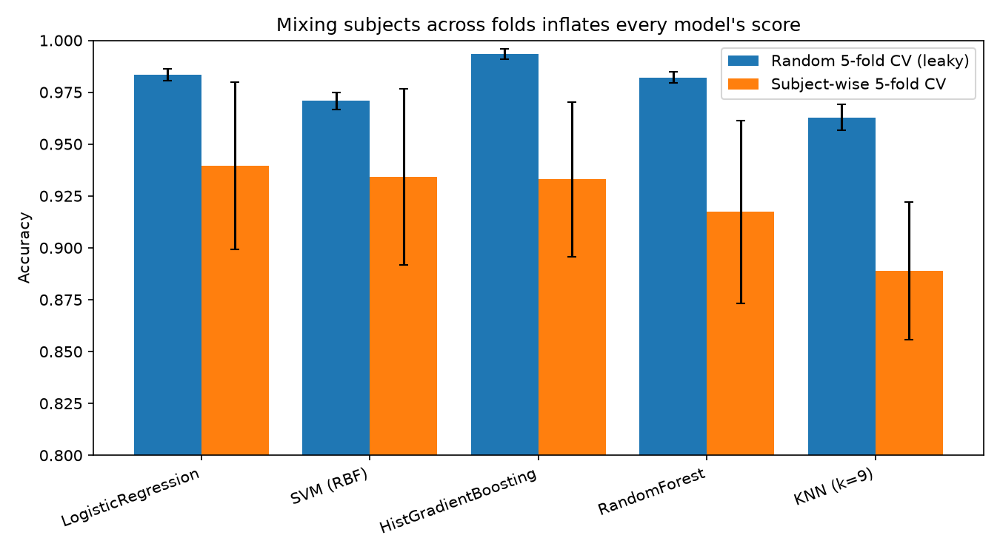
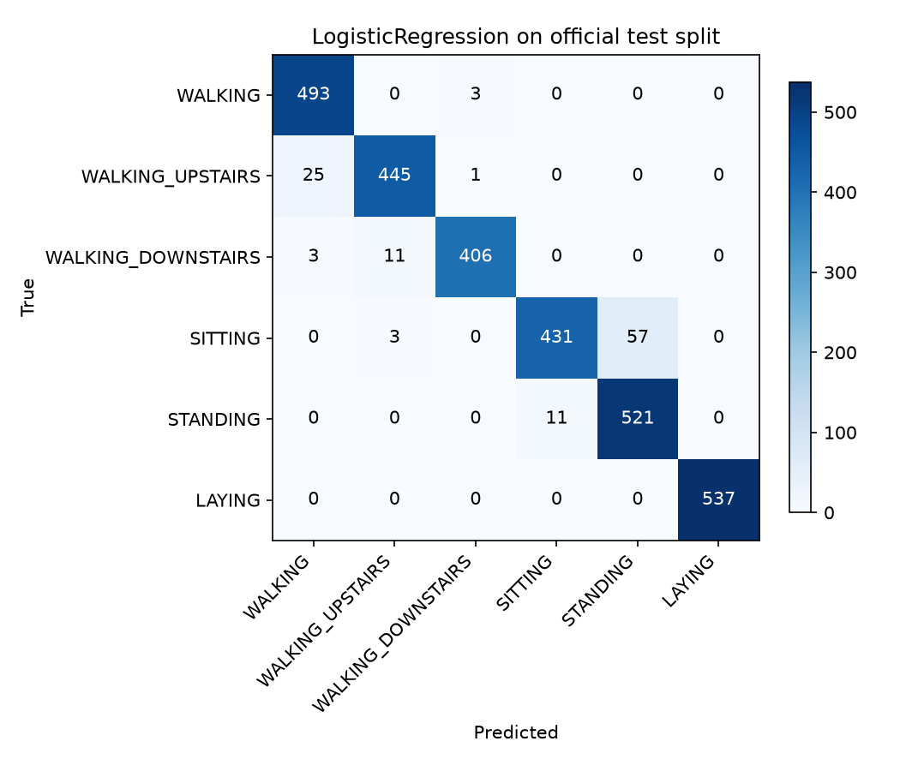
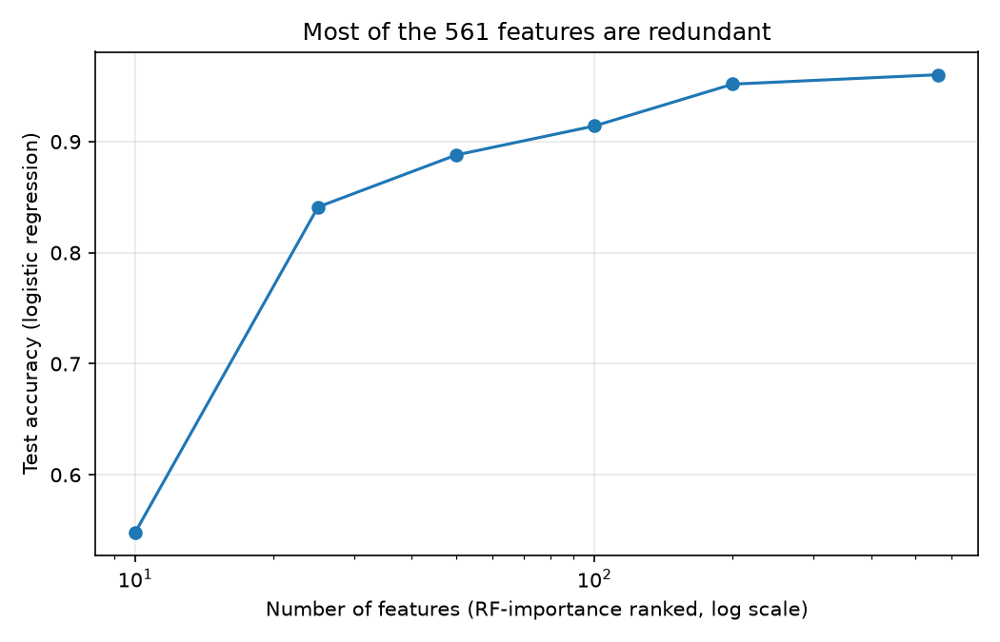

# Human Activity Recognition

Classifying six daily activities (walking, walking upstairs, walking downstairs, sitting, standing, laying) from smartphone accelerometer and gyroscope data — the [UCI HAR dataset](https://archive.ics.uci.edu/dataset/240/human+activity+recognition+using+smartphones) (30 subjects, 50 Hz, 2.56 s windows).

This is more than a model comparison. The project asks — and answers, with experiments you can rerun — four questions that a plain accuracy table hides:

1. **How much does data leakage inflate HAR results?** (a lot — quantified below)
2. **Where do the errors actually live?** (one confusion pair accounts for half of them)
3. **How many of the 561 engineered features are actually needed?** (~200)
4. **Can a CNN on raw signals match hand-engineered features?** (see results)

## Key findings

### 1. Random CV overstates every model — evaluate subject-wise

Most tutorials shuffle windows into folds, so the same person appears in train *and* test. Since consecutive windows overlap 50%, that protocol answers "can I recognize people I've already seen?" instead of "does this work for a new user?". Comparing both protocols on identical models:

| Model | Random 5-fold CV | Subject-wise 5-fold CV | Official test (unseen subjects) |
|---|---|---|---|
| Logistic Regression | 98.3% | **94.0% ± 4.0** | **96.1%** |
| SVM (RBF) | 97.1% | 93.4% ± 4.2 | 95.0% |
| HistGradientBoosting | 99.3% | 93.3% ± 3.7 | 93.2% |
| Random Forest | 98.2% | 91.7% ± 4.4 | 92.9% |
| KNN (k=9) | 96.3% | 88.9% ± 3.3 | 90.5% |

Every model drops 3–7 points under the honest protocol, and the ranking changes: HistGradientBoosting looks best under random CV (99.3%) but is mid-pack on unseen subjects. The simplest model — logistic regression — wins, because the 561 features already encode the domain knowledge.



### 2. Half of all errors are one confusion: SITTING vs STANDING

| True → Predicted | Share of all errors |
|---|---|
| SITTING → STANDING | **50.0%** |
| WALKING_UPSTAIRS → WALKING | 21.9% |
| STANDING → SITTING | 9.6% |
| WALKING_DOWNSTAIRS → WALKING_UPSTAIRS | 9.6% |

Static postures produce almost no motion signal — only a slightly different gravity orientation — so they are intrinsically hard to separate. LAYING, whose gravity vector is orthogonal, is classified perfectly (F1 = 1.00).

Errors are also concentrated in *people*, not spread evenly: test subjects range from 87.1% to 99.7% accuracy with the same model (`results/per_subject_accuracy.png`). Window-averaged accuracy hides that a deployed app would work great for some users and poorly for others.



### 3. A two-stage classifier does NOT help — and that's informative

The gate (static vs dynamic) is **100% accurate** on the test set, so we can split the problem hierarchically and give the static postures a dedicated classifier. Result: 95.0% — statistically identical to the flat model. The SITTING/STANDING confusion is a limitation of the *features*, not of shared model capacity. Fixing it needs different signals (e.g. barometer, or personalized calibration), not a cleverer classifier.

### 4. Most of the 561 features are redundant

21 columns are exact duplicates, 42 feature names appear more than once, and 2,252 feature pairs correlate above |r| = 0.95. Ranking features by random-forest importance and retraining on prefixes:

| Features used | Test accuracy |
|---|---|
| 10 | 54.8% |
| 50 | 88.8% |
| 100 | 91.4% |
| 200 | 95.2% |
| 561 | 96.0% |

~200 well-chosen features buy 99% of full performance — relevant if you're computing features on-device in real time.



### 5. Deep learning on raw signals

`har/deep.py` trains a small 1D CNN (3 conv blocks, ~30k parameters) directly on the raw 9-channel × 128-sample inertial windows — no hand-engineered features at all. Validation subjects are held out from the training split, so model selection is subject-wise too.

**Result: 91.2% test accuracy** (macro F1 0.91). On the dynamic activities the CNN is competitive with the classical models (WALKING F1 = 0.97), but it loses most where every model loses — SITTING (0.82) and STANDING (0.83). Takeaway: with only 21 training subjects, 561 expert-designed features still beat learned features by ~5 points, and the intrinsic static-posture ambiguity hurts both approaches equally. Full per-class numbers in `results/cnn.json`.

## Project structure

```
├── har/                  # the package — every module is runnable
│   ├── data.py           #   dataset download + loaders (features & raw signals)
│   ├── train.py          #   model comparison under all three protocols
│   ├── features.py       #   redundancy analysis + selection curve
│   ├── two_stage.py      #   hierarchical static/dynamic classifier
│   ├── error_analysis.py #   per-subject accuracy + confusion-pair shares
│   ├── deep.py           #   1D CNN on raw signals (needs torch)
│   └── evaluate.py       #   shared CV protocols, metrics, plots
├── results/              # generated metrics (csv/json) and figures
├── notebooks/            # the original exploratory notebook
├── tests/                # smoke tests (pytest)
└── requirements.txt
```

## Reproduce everything

```bash
git clone https://github.com/ThePunisher30/Human-Activity-Recognition.git
cd Human-Activity-Recognition
pip install -r requirements.txt

python -m har.train           # model comparison + leakage gap + confusion matrix
python -m har.features        # redundancy report + feature-selection curve
python -m har.two_stage       # hierarchical classifier
python -m har.error_analysis  # per-subject accuracy + error pairs
python -m har.deep            # 1D CNN on raw signals (pip install torch first)
```

The dataset (~60 MB) downloads automatically into `data/` on first run. All randomness is seeded; the tables above regenerate to the digit.

```bash
python -m pytest tests/       # sanity checks on data integrity and the pipeline
```

## Dataset notes

- 7,352 train / 2,947 test windows; the official split is **subject-disjoint** (21 vs 9 people, no overlap) — keep it that way.
- Classes are near-balanced (13–19% each); features ship pre-normalized to [-1, 1] with no missing values, so no imputation or scaling stage is needed (KNN distances are already on a common scale).
- Raw inertial signals (9 × 128 per window) are included alongside the engineered features and are what `har/deep.py` consumes.

## License

MIT
